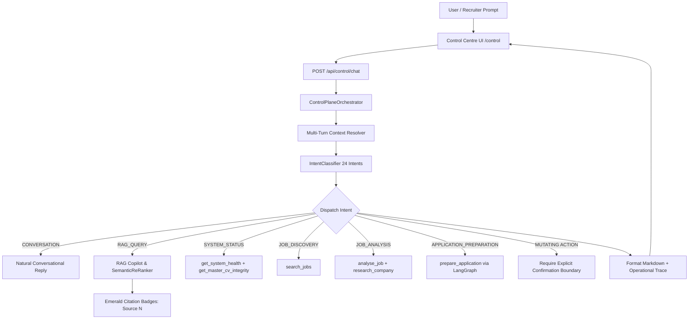

# /control-plane — Intelligent Control-Plane & Conversational Orchestrator Skill

## Purpose
Governs the autonomous command centre interface (`/control`), API endpoints (`/api/control/chat`, `/api/control/status`, `/api/control/model`), and the multi-agent conversational orchestrator (`src/lib/control/orchestrator.ts`). Provides natural, grounded conversational intelligence regarding Whitemore Ngwira's complete career dossier and orchestrates 20 backend system tools.

## Core Architecture

## Key Invariants & Features
1. **Multi-Turn Conversational Memory**:
   - Accepts `history?: ChatHistoryMessage[]` (up to 10 turns).
   - Resolves pronouns and ordinal references (e.g., *"Tell me more about the second one"*, *"What AWS services did it use?"*) via `resolveContextualQuery`.
   - Enriches RAG semantic search queries with resolved entities.
2. **Conversational Pleasantries**:
   - Courteously acknowledges *"thanks!"*, *"awesome"*, *"great"*, *"cool"*, and *"got it"* without triggering unneeded tool runs.
3. **Deterministic Tool Binding (7 Primary Codified Tools)**:
   - `query_rag`: pgvector evidence search with strict >= 0.75 grounding threshold.
   - `search_jobs`: Real vacancy discovery across South African and regional markets.
   - `prepare_application`: Non-destructive LangGraph stateful package preparation.
   - `get_master_cv_integrity`: Cryptographic SHA-256 validation (`3994A09C...`).
   - `get_ai_model_status`: Truthful OpenCode Zen provider verification.
   - `get_scheduler_status`: Cloud cron lease lock telemetry.
   - `get_observability_status`: Prometheus & 9 Grafana Cloud dashboards.
4. **Safety & Approval Boundary**:
   - Mutating dispatches (`APPLICATION_SUBMISSION`) strictly require candidate confirmation via UI banner before execution.
5. **Zero Hallucination Policy**:
   - Off-topic or ungrounded queries return a structured **Factual Boundary Notice** outlining valid system operations rather than apologetic or fake claims.
6. **Executive Chat UI**:
   - Zero-dependency markdown rendering (`ChatMarkdownRenderer`) with code blocks, tables, and styled emerald badge chips (`[Source N: Title]`).
   - One-click copy message with visual confirmation.
   - One-click export of chat transcript as Markdown (`.md`).
   - Clear conversation reset.
   - Interactive top-bar model switcher across all 5 OpenCode Zen models.
   - Auto-expanding multiline textarea with `Enter ↵` to send and `Shift + Enter` for newlines.
