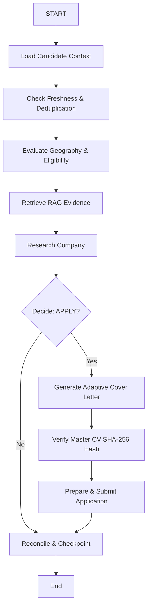

# /langgraph-orchestration — LangGraph Agentic Pipeline Skill

## Purpose
Orchestrates the multi-node, stateful job application lifecycle with typed annotations, conditional branches, and persistent checkpointing.

## Pipeline Lifecycle

## State & Checkpointing
- All nodes operate on `ApplicationStateAnnotation`.
- Ineligible jobs conditionally bypass generation and submission nodes to protect candidate reputation and prevent spam.
- Submissions require both `decision === "APPLY"` and `cvHashVerified === true`.
