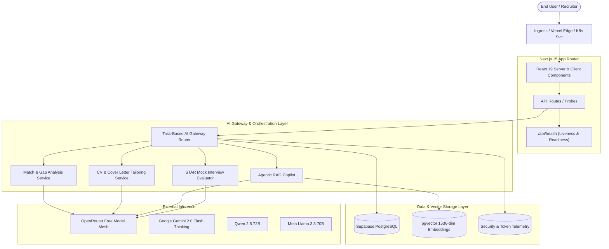

# ApplyWise AI — Flagship Full-Stack Agentic Engineering Showcase

[](https://github.com/nwhite/applywise-ai/actions/workflows/ci.yml)
[](https://github.com/nwhite/applywise-ai/actions/workflows/docker.yml)
[](https://github.com/nwhite/applywise-ai/actions/workflows/k8s.yml)
[](LICENSE)

> **Autonomous Job Application Operating System & AI Career Architecture Platform**  
> Engineered by **Whitemore Ngwira (N. White)** — Principal Technology Architect & AI Systems Engineer.

---

## 🌟 Executive Summary

**ApplyWise AI** is an enterprise-grade, production-ready AI application platform designed to automate and augment the high-stakes job application lifecycle for senior and executive technology leaders. 

Unlike shallow AI wrapper prototypes, ApplyWise AI implements:
- **Strict Anti-Hallucination Boundaries**: AI generation is strictly anchored to verified career milestones (EarCodeX InsurTech on AWS, Socinga Smart Mining telemetry, Cineterns & Oasis College, 21 media broadcast pipelines).
- **Multi-Tier Model Routing**: Intelligent gateway dynamically switching between high-reasoning models (Gemini 2.0 Flash Thinking) and cost-effective models with automatic fallback.
- **Agentic Career Copilot (RAG)**: Dense vector similarity search with metadata-filtering and strict citation transparency.
- **Enterprise Cloud Native Architecture**: Multi-stage hardened Docker container (<180MB, non-root UID 1001), Kubernetes manifests with 3-tier health probes, HPA, and production Helm v3 charts.
- **100% Free-Tier Architecture**: Built to operate completely within legitimate free developer tiers across OpenRouter, Supabase PostgreSQL/pgvector, and Vercel.

---

## 🏗️ System Architecture



---

## 🚀 Key Modules & Capabilities

| Module | Route | Description |
|---|---|---|
| **Executive Dashboard** | `/` | Pipeline overview, response rate metrics, quick actions, and recent activity feed. |
| **Job Discovery** | `/jobs` | Ingestion, faceted search, and deep AI match scoring with requirement gap analysis. |
| **CV Studio** | `/cv-studio` | Side-by-side ATS diff comparison with evidence-grounded bullet enhancement. |
| **Cover Letter Generator** | `/cover-letters` | Evidence-backed executive letters citing verified architectural projects. |
| **Application CRM** | `/applications` | Kanban workflow tracking stages from Draft to Offer with interview schedules. |
| **Career Copilot (RAG)** | `/rag-search` | Semantic career search with citation pills linked to verified project achievements. |
| **Interview Prep** | `/interviews` | Mock question practice with STAR method rubrics and AI evaluation. |
| **System Analytics** | `/analytics` | Skill heatmaps, application funnel conversion, and AI gateway telemetry. |
| **Model & Gateway Settings** | `/settings` | Real-time OpenRouter model selection, temperature control, and API configuration. |
| **Master Profile** | `/profile` | Candidate ground truth, verified skills, and production milestone evidence. |

---

## 🐳 Containerisation & Kubernetes

### Docker Multi-Stage Build
The container is built for security and efficiency:
- Base: `node:20-alpine` (Minimal attack surface)
- Security: Non-root execution (`USER nextjs`, UID 1001, GID 1001)
- Bundling: Next.js standalone output with zero unnecessary node_modules in runner
- Healthcheck: Native `HEALTHCHECK` hitting `/api/health`

```bash
# Run via Docker Compose
docker compose up --build -d

# Inspect health status
docker inspect --format='{{json .State.Health}}' applywise-ai-app
```

### Kubernetes Orchestration (`k8s/`)
- **Deployment**: 2 replicas with RollingUpdate (`maxSurge: 1, maxUnavailable: 0`)
- **Probes**: Three-tier health monitoring (Startup, Liveness, Readiness)
- **HPA**: HorizontalPodAutoscaler scaling from 2 to 5 replicas based on CPU/Memory
- **Security**: Strict Pod Security Standards (`runAsNonRoot: true`, capabilities dropped)
- **NetworkPolicy**: Least privilege ingress and egress boundaries

### Helm Chart (`helm/applywise-ai`)
```bash
# Lint Helm chart
helm lint helm/applywise-ai

# Render production template
helm template test-prod helm/applywise-ai -f helm/applywise-ai/values-production.yaml

# Deploy to cluster
helm install applywise-ai helm/applywise-ai -f helm/applywise-ai/values-production.yaml
```

---

## 🛡️ Testing & Quality Gates

Every commit passes strict automated quality gates:

```bash
# Static TypeScript verification
npm run type-check

# ESLint analysis (0 warnings policy)
npm run lint

# Automated unit and integration tests
npm test

# Production standalone build verification
npm run build
```

---

## 👤 Candidate Ground Truth

This platform is engineered around the verified career accomplishments of **Whitemore Ngwira (N. White)**:
- **EarCodeX InsurTech**: Architected AWS microservices platform handling thousands of claims with 99.9% uptime.
- **Socinga Smart Mining**: Engineered real-time IoT and telemetry systems for harsh mining environments.
- **Cineterns & Oasis College**: Built modern web platforms utilizing Next.js, Supabase, and Claude API integration.
- **Broadcast Media**: Delivered 21 enterprise media automation and streaming pipelines.

---

## 📜 License

MIT License. Designed & engineered for technical recruitment and architectural demonstration.
