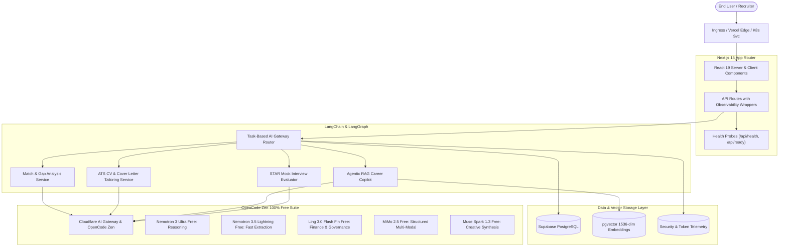
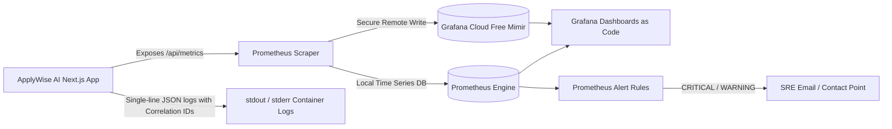
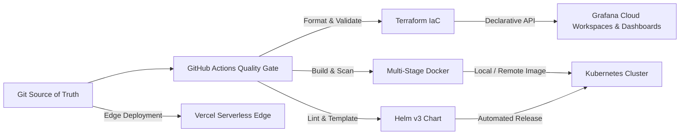

# ApplyWise AI — Flagship Full-Stack Agentic Engineering Showcase

[](https://github.com/nwhite/applywise-ai/actions/workflows/ci.yml)
[](https://github.com/nwhite/applywise-ai/actions/workflows/docker.yml)
[](https://github.com/nwhite/applywise-ai/actions/workflows/k8s.yml)
[](https://github.com/nwhite/applywise-ai/actions/workflows/observability.yml)
[](LICENSE)

> **Autonomous Job Application Operating System & AI Career Architecture Platform**  
> Engineered by **Whitemore Ngwira (N. White)** — Principal Technology Architect & AI Systems Engineer.

---

## 🌟 Executive Summary

**ApplyWise AI** is an enterprise-grade, production-ready full-stack AI SaaS engineered to automate, optimize, and govern the job application lifecycle for senior and executive engineering leaders. 

Unlike superficial AI wrapper prototypes, ApplyWise AI demonstrates a comprehensive, senior-level systems engineering lifecycle:
- **Strict Anti-Hallucination Boundaries**: AI generation is anchored to verified career milestones (EarCodeX InsurTech on AWS, Socinga Smart Mining telemetry, Cineterns & Oasis College, 21 media broadcast automation pipelines).
- **Multi-Model Routing Gateway**: Dynamic routing between verified OpenCode Zen free models (Nemotron 3 Ultra, Nemotron 3.5 Lightning, Ling 3.0 Flash Fin, MiMo 2.5, Muse Spark 1.3) with circuit breakers and Cloudflare AI Gateway caching.
- **Agentic Career Copilot (RAG)**: Dense vector similarity retrieval with metadata filtering, provenance transparency, and clickable source citation pills.
- **Enterprise Cloud Native**: Hardened multi-stage Docker container (<180MB, non-root UID 1001), Kubernetes manifests with 3-tier health probes, HPA, and Helm v3 packaging.
- **Production Observability Stack**: First-class Prometheus metrics scraping (`/api/metrics`), low-cardinality label design, Grafana Cloud Free integration, and version-controlled Dashboards as Code.
- **Infrastructure as Code (Terraform)**: Modular Terraform configurations declaring Grafana Cloud workspaces, folders, dashboards, and alerting contact points.
- **100% Free-Tier Architecture**: Built to operate within legitimate free developer tiers across OpenCode Zen, Cloudflare AI Gateway, Supabase PostgreSQL/pgvector, Grafana Cloud, and Vercel.

---

## 🏗️ Comprehensive Engineering Architecture

### 1. Application & AI Agent Flow


### 2. Production Telemetry & Observability Pipeline


### 3. Infrastructure as Code & GitOps Delivery


---

## 🏛️ Architecture & Engineering Stack

| Technology | Role & Architectural Functionality |
|---|---|
| **Next.js 15** | Modern full-stack framework with React Server Components, App Router API handlers, Turbopack bundling, and standalone container output. |
| **TypeScript** | Strict compile-time typing across AI models, database contracts, and domain services, eliminating null-pointer runtime errors. |
| **Supabase** | Managed PostgreSQL platform providing instant relational data persistence, Row-Level Security (RLS), and database auth. |
| **PostgreSQL** | Enterprise relational database providing ACID compliance for the candidate CRM pipeline, job listings, and application history. |
| **pgvector** | Native vector database extension inside PostgreSQL supporting cosine distance (`<=>`) semantic indexing for verified knowledge chunks. |
| **LangChain** | AI primitives for structured prompt templates, output parsers, and vector store retrieval abstractions. |
| **LangGraph** | Stateful, cyclic agent graph orchestration for iterative job analysis, candidate gap evaluation, and ATS tailoring. |
| **RAG & Agentic RAG** | Hybrid dense semantic and keyword retrieval ensuring all career copilot answers are backed by immutable project evidence. |
| **OpenCode Zen** | 100% Free-Tier AI Model Suite (Nemotron 3 Ultra, Nemotron 3.5 Lightning, Ling 3.0, MiMo 2.5, Muse Spark 1.3) routed via Cloudflare AI Gateway with circuit breakers. |
| **Docker** | Multi-stage, hardened container image on `node:20-alpine` running as non-root user `nextjs` (UID 1001) with standalone bundle (<180MB). |
| **Kubernetes** | Production orchestration with 2-replica Deployment, RollingUpdates, HorizontalPodAutoscaler (HPA), and NetworkPolicies. |
| **Helm v3** | Parameterized packaging for reproducible cluster deployments with environment overlays (`values-development.yaml`, `values-production.yaml`). |
| **Terraform** | Declarative Infrastructure as Code codifying Grafana Cloud folders, dashboards as code, and alert notification contact points. |
| **Prometheus** | Industry-standard time-series monitoring scraping `/api/metrics` every 15s with low-cardinality labels protecting metric memory. |
| **Grafana Cloud Free** | Centralized observability SaaS displaying 5 pre-built production dashboards covering application, AI, Kubernetes, and database operations. |
| **GitHub Actions** | Automated CI/CD pipelines enforcing ESLint, TypeScript checks, Vitest tests, Docker builds, Helm linting, and Terraform validation. |
| **Vercel** | Serverless edge hosting providing global CDN caching, instant branch previews, and edge route execution. |

---

## 📊 Production Grafana Dashboards as Code

All dashboard configurations are stored as version-controlled JSON definitions in `observability/grafana/dashboards/`:

1. **Dashboard 1 — Application Overview (`01-application-overview.json`)**:
   - Four Golden Signals: Request rate (RPM), 5xx Error %, p95 Latency (ms), Active sessions.
   - Inbound traffic breakdown by API route and status code.
   - Request duration quantiles (p50 median, p90, p99).
2. **Dashboard 2 — AI Operations & Agentic Workflows (`02-ai-operations.json`)**:
   - Total AI gateway invocations and estimated token consumption.
   - p95 Inference latency across models (Gemini vs Qwen vs Llama).
   - Model fallback and degradation events.
   - Vector RAG retrieval latency and chunk yield distributions.
   - LangGraph agent workflow execution duration.
3. **Dashboard 3 — Kubernetes & Container Workloads (`03-kubernetes-workloads.json`)**:
   - Node.js Heap memory used vs allocated vs process limits.
   - Resident set size (RSS) and user CPU percentage rate.
   - Garbage collection frequency and Event Loop Lag (p95).
4. **Dashboard 4 — Database & Storage Operations (`04-database-storage.json`)**:
   - PostgreSQL query throughput and p95 latency.
   - Error rates across relational queries and pgvector similarity searches.
5. **Dashboard 5 — Business Intelligence & Pipeline Activity (`05-business-intelligence.json`)**:
   - Jobs ingested and gap-analyzed.
   - Application CRM funnel breakdown by stage (Draft, Applied, Interviewing, Offer).
   - Generation velocity for ATS CVs and tailored cover letters.

---

## 🚨 Alerting Strategy & Severities

Alerts are defined in `observability/prometheus/alerts.yml` with clear severity classification:

- **CRITICAL** (Requires Immediate Action):
  - `ApplyWiseAppDown`: Process or container unreachable for > 1 minute.
  - `HighHttpErrorRate`: Inbound 5xx server errors exceed 5% over 5 minutes.
  - `ExcessiveAIModelFailures`: AI gateway model errors exceed 0.1 errors/sec.
  - `DatabaseErrorElevated`: Database transactions failing or rejecting connections.
- **WARNING** (Action Required Within Working Hours):
  - `ElevatedHttpLatency`: p95 HTTP response latency exceeds 2.5 seconds for 5 minutes.
  - `ExcessiveModelFallbacks`: Primary AI models frequently degrading to backup engines.
  - `LangGraphWorkflowFailures`: Agent loops terminating abnormally or timing out.

---

## 🛠️ Infrastructure as Code (Terraform) Execution

```bash
cd terraform

# 1. Verify code formatting
terraform fmt -check -recursive

# 2. Initialize provider plugins without backend requirement
terraform init -backend=false

# 3. Validate configuration syntax and schema
terraform validate

# 4. Plan provisioning of Grafana Cloud resources
cp terraform.tfvars.example terraform.tfvars
terraform plan
```

---

## 🐳 Containerisation & Kubernetes Quickstart

### Local Container Run
```bash
# Run with Docker Compose (includes health checks and resource limits)
docker compose up --build -d

# Inspect running healthcheck
docker inspect --format='{{json .State.Health}}' applywise-ai-app
```

### Kubernetes & Helm Deployment
```bash
# Dry-run validate Kubernetes static manifests
kubectl apply --dry-run=client -f k8s/

# Lint and template Helm chart
helm lint helm/applywise-ai
helm template test-prod helm/applywise-ai -f helm/applywise-ai/values-production.yaml

# Deploy to cluster
helm install applywise-ai helm/applywise-ai -f helm/applywise-ai/values-production.yaml
```

---

## 🛡️ Testing & Quality Gates

Every commit must pass all automated verification checks before merging:

```bash
# Static TypeScript verification
npm run type-check

# ESLint analysis (0 warnings policy)
npm run lint

# Automated unit and integration test suite
npm test

# Production standalone bundle compilation
npm run build
```

---

## 👤 Candidate Ground Truth & Production Systems Proven

The AI models in this platform operate with **strict anti-hallucination boundaries**, drawing exclusively from Whitemore Ngwira's verified career milestones:
1. **EarCodeX InsurTech**: Architected AWS microservices platform handling thousands of claims with 99.9% uptime.
2. **Socinga Smart Mining**: Engineered real-time IoT and telemetry systems for harsh mining environments.
3. **Cineterns & Oasis College**: Built modern web platforms utilizing Next.js, Supabase, and Claude API integration.
4. **Broadcast Media**: Delivered 21 enterprise media automation and streaming pipelines.

---

## 📜 License

MIT License. Designed & engineered for senior technical recruitment, architectural demonstration, and client review.
