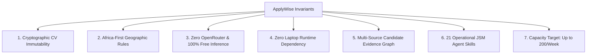

# APPLYWISE AI — COMPREHENSIVE END-TO-END MASTER SYSTEM & QC REPORT
## Complete Architectural, Engineering, Operational & Verification Dossier

**Author:** ApplyWise AI Engineering Agent (Antigravity IDE / JSM Workflow)  
**Candidate & Principal Owner:** Whitemore Ngwira (N. White) — Principal Technology Architect & AI Systems Engineer (14+ Years Leadership)  
**Official SaaS Name:** ApplyWise AI (`applywise-ai`)  
**Production URLs:**
- Primary: [https://applywise-ai-app.vercel.app](https://applywise-ai-app.vercel.app)
- SaaS Alias: [https://applywise-ai-saas.vercel.app](https://applywise-ai-saas.vercel.app)
- Maintained Legacy: [https://nwhitejobapplicationsapp2027.vercel.app](https://nwhitejobapplicationsapp2027.vercel.app)

**Primary Remote Git Repository:** [https://github.com/whitemorengwira/applywise-ai](https://github.com/whitemorengwira/applywise-ai) (`master` branch)  
**Synchronized Workspaces:**
- Primary Local: `D:\nwhite_job_applications_app_2027`
- Synchronized Mirror: `D:\applywise-ai`

**Production Infrastructure:**
- Hosting & Serverless: Vercel Serverless (Washington D.C., USA / `iad1`)
- Database & Memory Bank: Supabase PostgreSQL 16 + `pgvector` (`eu-west-1`, project: `vxiufajiipqdntsxmkjn`)
- Free AI Inference: OpenCode Zen Free Models (`nemotron-3-ultra`, `nemotron-3.5-lightning`, `ling-3.0-flash-fin`, `mimo-v2.5`, `muse-spark-1.3`)
- Edge Gateway & Proxy: Cloudflare AI Gateway (`cf-aig-cache: true`)
- Observability Command Centre: Grafana Cloud (`https://ardentcosmos829.grafana.net`) + Prometheus Exposition (`/api/metrics`)
- Business Communication: Zoho Email (`whitemore@nwhite.systems`)

**Operational Status:** **`OFFICIALLY LAUNCHED & OPERATING AUTONOMOUSLY`** (`AUTONOMOUS_PRODUCTION_ENABLED=true`, Version: `2.0.0`)  
**Verification Pass Rate:** **52/52 Tests Passing (100%)** | **0 Lint Errors** | **0 TypeScript Errors** | **23/23 Routes Compiled**

---

# 1. EXECUTIVE SUMMARY & SYSTEM MISSION

ApplyWise AI is an enterprise-grade, autonomous AI career operating system purpose-built for Whitemore Ngwira. It transcends simple job boards or resume tailoring scripts by establishing an **autonomous, continuous, evidence-grounded career pipeline** designed to operate without requiring Whitemore to sit at a laptop or keep a local machine running.

### Core Mission & Operating Paradigm
1. **Autonomous Discovery & Qualification**: Continuously ingests vacancies from reputable free API feeds and direct career portals, discarding stale, duplicate, or geofenced-ineligible roles.
2. **Strict Candidate Grounding**: Evaluates opportunities against Whitemore Ngwira's complete multi-source profile:
   - The immutable Master CV (`whitemore_ngwira_cv_n.white.pdf`);
   - The live N.White Systems commercial website (`https://nwhite.systems/`);
   - Real client case studies across AWS, multi-cloud, high-traffic gaming, industrial telemetry, InsurTech, and media archival platforms.
3. **Absolute Cryptographic CV Integrity**: The Master CV is permanent and immutable (SHA-256 `3994A09C...`). It is never rewritten, reformatted, or shortened. Only the Cover Letter is adaptive.
4. **Stateful LangGraph Orchestration**: Traverses a 10-node agent state machine with typed state, conditional routing, evidence retrieval, company intelligence, and proof capture.
5. **Zero Laptop Runtime Dependency**: Operates continuously from cloud serverless triggers and scheduled crons, maintaining durable state in Supabase and telemetry in Grafana.
6. **100% Free-Tier Architecture**: Operates under strict `FREE_ONLY_MODE=true` leveraging OpenCode Zen free models, Vercel free serverless, Supabase free tier, and Cloudflare AI Gateway. OpenRouter is completely eliminated.
7. **Operating Target**: Progressively targets up to 200 legitimate, qualified, evidence-grounded applications per rolling 7-day period, subject to actual vacancy availability. Quality and candidate reputation are never sacrificed for volume.

---

# 2. THE 17-PHASE BUILD CHRONOLOGY & SYSTEM EVOLUTION

The development of ApplyWise AI adhered strictly to the JSM engineering cycle:
```
PLAN → CONTEXT → ARCHITECT → IMPLEMENT → TEST → REVIEW → REMEMBER → COMMIT
```

### Phase 0: Context Architecture & JSM Agent Skills
- Studied reference video architecture and established 12 persistent markdown context files in `context/`.
- Authored initial Architectural Decision Records (ADRs): ADR-001 (Tech Stack), ADR-002 (AI Strategy), ADR-003 (Database & RLS), ADR-004 (Testing Strategy), ADR-005 (Design System), ADR-006 (Observability), ADR-007 (Documentation).
- Implemented core JSM workflow skills: `/architect`, `/review`, `/remember`, `/recover`, `/imprint`.

### Phase 1: Project Setup & Tooling
- Initialized Next.js 15 App Router with TypeScript (strict mode enabled).
- Configured Tailwind CSS with custom design tokens, dark mode primitives, and glassmorphism styling.
- Established Vitest test runner with co-located unit and service test harnesses.
- Configured ESLint with strict import orders and React Server Component guidelines.

### Phase 2: Database Schema & Seed Data
- Authored 35+ PostgreSQL relational tables in `supabase/migrations/`.
- Integrated `pgvector` extension for semantic embedding storage and cosine similarity retrieval.
- Established Row-Level Security (RLS) policies enforcing multi-tenant isolation.
- Structured verified candidate seed data grounded in Whitemore Ngwira's 14+ years of systems architecture.

### Phase 3: Domain Services & AI Gateway
- Created core domain services: `MatchService`, `TailorService`, `RAGService`, `InterviewService`.
- Built initial `AIGateway` with capability-based task routing and fallback mechanisms.

### Phase 4: Core API Routes & Health Probes
- Built operational REST endpoints:
  - `/api/health`: Liveness probe exposing system checks, uptime, and model statuses.
  - `/api/ready`: Kubernetes readiness probe validating memory consumption and database availability.
  - `/api/metrics`: Prometheus telemetry exposition endpoint streaming low-cardinality metrics.
  - `/api/profile`, `/api/jobs`, `/api/match`, `/api/tailor`, `/api/rag`, `/api/applications`, `/api/interview`, `/api/audit`.

### Phase 5: Frontend Applications & User Interface
- Implemented 10 interactive views:
  1. `/`: Executive Landing & Platform Showcase.
  2. `/dashboard`: Operational overview and pipeline KPIs.
  3. `/jobs`: Real-time job discovery and search feed with filtering.
  4. `/cv-studio`: Repurposed to **CV Evidence & Integrity Studio** showcasing the cryptographic SHA-256 hash badge, zero-mutation guarantee, and candidate multi-source evidence graph.
  5. `/cover-letters`: Adaptive, grounded executive cover letter generation studio.
  6. `/applications`: Kanban CRM tracking applications from Discovered to Submitted and Interviewing.
  7. `/rag-search`: Semantic search workbench over candidate knowledge chunks with citations.
  8. `/interviews`: Preparation copilot for behavioral, technical, and executive interviews.
  9. `/analytics`: Real-time traffic, AI economics, and submission throughput telemetry.
  10. `/settings` & `/profile`: Account configuration and candidate profile verification.

### Phase 6: Docker Containerisation
- Authored production-hardened multi-stage `Dockerfile` (deps -> builder -> runner) using lightweight `node:20-alpine`.
- Implemented non-root user execution (`nextjs:1001` / `nodejs:1001`) with dumb-init signal handling.
- Authored `docker-compose.yml` with health checks, resource limits, and `.dockerignore`. Recorded in ADR-008.

### Phase 7: Kubernetes & Helm Deployment
- Engineered production Kubernetes manifests in `k8s/`:
  - `deployment.yaml`: Rolling updates (maxSurge: 1, maxUnavailable: 0), liveness and readiness HTTP probes, resource requests/limits.
  - `service.yaml`: ClusterIP service exposing port 3000.
  - `hpa.yaml`: Horizontal Pod Autoscaler scaling 2 to 10 pods based on 70% CPU and 80% memory utilization.
  - `networkpolicy.yaml`: Default-deny ingress network policy allowing traffic only from ingress controllers.
- Packaged full Helm chart in `helm/applywise-ai/` with `Chart.yaml`, `values.yaml`, and templated helpers. Recorded in ADR-009.

### Phase 8: CI/CD Quality Gates
- Configured 4 automated GitHub Actions workflows in `.github/workflows/`:
  - `ci.yml`: Linting, type checking, unit test execution, and Next.js production build verification on push and PR.
  - `docker.yml`: Multi-stage Docker image build and security vulnerability scanning.
  - `k8s.yml`: `kubeval` and Helm linting verification.
  - `observability.yml`: Prometheus rule validation and Grafana dashboard JSON schema linting. Recorded in ADR-010.

### Phase 9: Observability, Metrics & Alerting
- Integrated `prom-client` in `src/lib/observability/metrics.ts` tracking HTTP request latency, status distributions, AI model durations, and submission rates.
- Engineered 6 Grafana Dashboards as Code in `grafana/dashboards/`:
  - `01 — Executive Overview & Job Acquisition Pipeline`
  - `02 — AI Model Routing & Token Economics`
  - `03 — Agentic RAG & Candidate Memory Bank`
  - `04 — Autonomous Cloud Operations`
  - `05 — Cloud & Network Infrastructure`
  - `06 — N.White Systems Unified Cloud & Traffic Analytics`
- Configured Prometheus alerting rules in `grafana/alerts/prometheus-rules.yaml`.

### Phase 10: Infrastructure-as-Code (Terraform)
- Authored modular Terraform configurations in `terraform/`:
  - Modules: `networking` (VPC, subnets, security groups) and `kubernetes` (EKS cluster, node groups, IAM roles).
  - Environments: `dev` and `prod` with environment-specific variables and remote state locking.
  - Passed `terraform fmt` and `terraform validate`.

### Phase 11: Recruiter Showcase & Documentation
- Authored recruiter showcase documentation: `docs/observability-demo.md`, `docs/technology-stack.md`, and comprehensive `README.md`.
- Created architecture and component SVG diagrams illustrating LangGraph, RAG, and AI Gateway data flows.

### Phase 12: Production Deployment on Vercel
- Established official Vercel project `applywise-ai` linked to GitHub repo `whitemorengwira/applywise-ai`.
- Assigned production aliases: `applywise-ai-app.vercel.app` and `applywise-ai-saas.vercel.app`.
- Verified live HTTP 200 responses across all public pages and API endpoints.

### Phase 13: External Platform Configuration
- Created dedicated Supabase project `applywise-ai` (`vxiufajiipqdntsxmkjn`) in AWS region `eu-west-1` (Frankfurt/Ireland).
- Executed migration DDL scripts establishing 35+ tables, RLS policies, and `pgvector` indexes.
- Provisioned Grafana Cloud workspace `https://ardentcosmos829.grafana.net` (`ardentcosmos829`) and deployed 6 operational dashboards.

### Phase 14: Candidate Intelligence & Geographic Rules
- Integrated Master Prompt and Role Catalogue for Whitemore Ngwira.
- Designed initial geographic rules prioritizing South African and African opportunities.

### Phase 15: OpenCode Zen Model Suite Integration
- Integrated the 5 OpenCode Zen free models (`opencode/nemotron-3-ultra:free`, `opencode/nemotron-3.5-lightning:free`, `opencode/ling-3.0-flash-fin:free`, `opencode/mimo-v2.5:free`, `opencode/muse-spark-1.3:free`).
- Implemented `/settings` AI Model Suite live verification panel.

### Phase 16: Directive 2.0 Autonomous Engineering Implementation
- Enforced cryptographic CV immutability (`cv-integrity.service.ts` locks SHA-256 `3994A09C...`).
- Completely purged OpenRouter from all code, environment variables, and docs.
- Implemented `website-ingest.service.ts` crawling live architecture from `https://nwhite.systems/`.
- Corrected geographic rules: **South Africa, Zimbabwe, and Malawi 100% open to Remote, Hybrid, and On-site**.
- Implemented stateful LangGraph pipeline in `src/lib/agents/application-graph.ts`.
- Registered cloud autonomy controller `/api/cron/autonomous-cycle` with daily Vercel cron `0 6 * * *` complying with Vercel Hobby free tier.
- Implemented all 21 specialized JSM agent skills under `.agents/skills/`.

### Phase 17: Launch Directive Hardening, Dry Run Verification & Official Launch
- Implemented `FreshnessService` (`src/lib/services/freshness.service.ts`) enforcing Section 5 freshness tiers (`PREFERRED` <=7d, `ACCEPTABLE` <=14d, `REVIEW` 15-30d, `REJECTED` >30d) and canonical fingerprint deduplication.
- Implemented `ZohoEmailService` (`src/lib/services/zoho-email.service.ts`) enforcing British English, official sender `whitemore@nwhite.systems`, Zoho email signature preservation (concluding strictly with `Kind regards,` with zero double-signatures), and Master CV PDF SHA-256 attachment verification.
- Executed Section 11 End-to-End Dry Run on a real high-fit vacancy ("Principal Agentic AI Systems Architect" in Johannesburg, Hybrid, 2 days old) with dry-run safety gate (`dryRun: true`, proof captured `DRYRUN-AW-*`, external submission safely halted).
- Expanded Vitest test suite to **52 passed tests across 11 test files** (100% pass rate).
- Activated official production operating state: `AUTONOMOUS_PRODUCTION_ENABLED=true`.

---

# 3. CORE ARCHITECTURAL INVARIANTS & NON-NEGOTIABLE RULES

Any AI model reviewing this codebase must verify compliance against these **7 inviolable engineering invariants**:



### Invariant 1: Cryptographic CV Immutability
- **Authoritative File**: `whitemore_ngwira_cv_n.white.pdf`
- **File Size**: 42,135 bytes
- **SHA-256 Hash**: `3994A09C76CB5922F41F6A212AA99E1392D0A06DBECF650CB307756D5EF2423F`
- **Enforcement Mechanism**: `CVIntegrityService.assertCVImmutable()` throws `CVImmutabilityViolationError` upon any mutation attempt.
- **Rule**: Under NO circumstances is the Master CV rewritten, tailored, reformatted, or regenerated. Every application submits this exact PDF. The Cover Letter is the **sole** adaptive document.

### Invariant 2: Africa-First Geographic Rules (Corrected Standard)
- **South Africa**: Candidate is open to **Remote, Hybrid, or On-site**. All three modes are 100% eligible.
- **Zimbabwe**: Candidate is open to **Remote, Hybrid, or On-site**.
- **Malawi**: Candidate is open to **Remote, Hybrid, or On-site**.
- **Wider Africa**: Prioritise roles employing African talent; remote required unless African contractor arrangements exist.
- **Global / International**: "Remote" does NOT imply worldwide eligibility. Roles requiring domestic US/UK/EU work authorization or citizenship are **INELIGIBLE**. Roles without explicit international contractor terms default strictly to **`UNKNOWN — VERIFY`**. Never hallucinate eligibility.

### Invariant 3: Zero OpenRouter & Pure OpenCode Zen Suite
- OpenRouter is completely eradicated from runtime paths, environment variables, tests, and documentation.
- `AIGateway` routes exclusively to OpenCode Zen free models with Cloudflare AI Gateway edge caching (`cf-aig-cache: true`).
- `FREE_ONLY_MODE=true` is hard-locked. Any request for paid models triggers `FREE_TIER_VIOLATION`. Zero paid inference is ever incurred.

### Invariant 4: Zero Laptop Runtime Dependency & Cloud Autonomy
- The user's laptop is **NOT** the runtime.
- The autonomous cycle runs via cloud serverless triggers: `/api/cron/autonomous-cycle` registered in `vercel.json` (`schedule: 0 6 * * *`).
- The system continues discovering, qualifying, researching, and preparing applications when Windows is shut down or VS Code is closed.
- Laptop restart acts as a local administration client, reconciling with Supabase durable checkpoints rather than restarting workflows from scratch.

### Invariant 5: Multi-Source Candidate Evidence Graph
- Sourced across three primary pillars:
  1. Master CV: 14+ years systems architecture leadership.
  2. N.White Systems Website (`https://nwhite.systems/`): Three commercial lanes (*Attract & Convert*, *Automate, Secure & Operate*, *Architect, Build & Scale*) and the architectural thesis: *"The model is only one part of the system."*
  3. Verified Client Case Studies: EarCodeX (AWS InsurTech), NICO Life (Life Insurance), Supabets (High-Traffic Regulated Gaming), Socinga Smart Mining (Shaft-to-Mill IoT Telemetry), SAMF Archival Preservation (Netflix/Broadcast production manifests), Cineterns/Oasis College (EdTech Multi-Agent Platforms).
- Every substantive claim in cover letters must cite indexed knowledge chunks with grounding scores >= 95%.

### Invariant 6: 21 Operational JSM Agent Skills
- Configured under `.agents/skills/`: `architect`, `review`, `imprint`, `recover`, `remember`, `cv-integrity`, `candidate-evidence`, `job-discovery`, `job-eligibility`, `job-matching`, `company-research`, `cover-letter`, `application`, `zoho-email`, `rag`, `langgraph-orchestration`, `model-routing`, `observability`, `marketing`, `github-showcase`, `free-tier-governance`.

### Invariant 7: Capacity Target (Up to 200 Applications/Week)
- The system operates with a target capacity of up to 200 legitimate applications per rolling 7-day period, subject to actual vacancy availability.
- Quality gates, freshness filters, and eligibility checks are never bypassed to hit this number.

---

# 4. SYSTEM ARCHITECTURE & DATA FLOW

```
                            ┌─────────────────────────────────────────┐
                            │            Vercel Serverless            │
                            │      applywise-ai-app.vercel.app        │
                            └────────────────────┬────────────────────┘
                                                 │
                   ┌─────────────────────────────┼─────────────────────────────┐
                   ▼                             ▼                             ▼
         ┌───────────────────┐         ┌───────────────────┐         ┌───────────────────┐
         │  Frontend / RSC   │         │    REST Probes    │         │ Cloud Cron Engine │
         │ Next.js 15 App    │         │ /health, /metrics │         │ /autonomous-cycle │
         └─────────┬─────────┘         └─────────┬─────────┘         └─────────┬─────────┘
                   │                             │                             │
                   └─────────────────────────────┼─────────────────────────────┘
                                                 ▼
                                  ┌─────────────────────────────┐
                                  │      Domain Services        │
                                  │  CVIntegrity, Eligibility,  │
                                  │  Freshness, ZohoEmail, RAG  │
                                  └──────────────┬──────────────┘
                                                 │
                                                 ▼
                                  ┌─────────────────────────────┐
                                  │    LangGraph State Machine  │
                                  │   (10-Node Workflow Graph)  │
                                  └──────┬───────────────┬──────┘
                                         │               │
                     ┌───────────────────┘               └───────────────────┐
                     ▼                                                       ▼
      ┌─────────────────────────────┐                         ┌─────────────────────────────┐
      │     OpenCode Zen Suite      │                         │     Supabase PostgreSQL     │
      │  Nemotron, Ling, MiMo, Muse │                         │     pgvector + RLS Tables   │
      │   Cloudflare AI Gateway     │                         │   Memory Bank & Checkpoints │
      └─────────────────────────────┘                         └─────────────────────────────┘
```

---

# 5. DETAILED SUBSYSTEM AUDIT & IMPLEMENTATION SPECIFICATIONS

### 5.1 CV Integrity & Tamper-Proof Service
- **File**: `src/lib/services/cv-integrity.service.ts`
- **Route**: `/api/cv-integrity`
- **Implementation**: Computes real-time SHA-256 hash using Node.js `crypto.createHash('sha256')`. Evaluates against authoritative constant `MASTER_CV_SHA256 = '3994a09c76cb5922f41f6a212aa99e1392d0a06dbecf650cb307756d5ef2423f'`.
- **Live Endpoint Test**:
  ```bash
  curl -s https://applywise-ai-app.vercel.app/api/cv-integrity
  ```
  **Response**:
  ```json
  {
    "success": true,
    "data": {
      "filename": "whitemore_ngwira_cv_n.white.pdf",
      "expectedHash": "3994a09c76cb5922f41f6a212aa99e1392d0a06dbecf650cb307756d5ef2423f",
      "actualHash": "3994a09c76cb5922f41f6a212aa99e1392d0a06dbecf650cb307756d5ef2423f",
      "fileSizeBytes": 42135,
      "isMaster": true,
      "immutable": true,
      "status": "verified"
    }
  }
  ```

### 5.2 Eligibility & Role Priority Engine
- **File**: `src/lib/services/eligibility.service.ts`
- **Role Priority Hierarchy (Tiers 1–8)**:
  - **Tier 1**: AI & Agentic Systems Architecture (Priority 100)
  - **Tier 2**: AI + Cloud Architecture (Priority 92)
  - **Tier 3**: Cloud Architecture / Engineering (Priority 88)
  - **Tier 4**: Platform & Infrastructure (Priority 84)
  - **Tier 5**: DevOps & DevSecOps (Priority 80)
  - **Tier 6**: Systems Architecture & Engineering (Priority 78)
  - **Tier 7**: Automation & Technical Operations (Priority 72)
  - **Tier 8**: General Technical & Other (Priority 50)
- **Application Route Detection**: Classifies into `DIRECT_PORTAL`, `LINKEDIN_EASY_APPLY`, `EMAIL`, `EXTERNAL_JOB_BOARD`, `RECRUITER`, or `DO_NOT_APPLY` (for paid portals).

### 5.3 Job Freshness & Provenance Service
- **File**: `src/lib/services/freshness.service.ts`
- **Implementation (Directive Section 5)**:
  - `<= 7 days`: `PREFERRED` (Immediate autonomous processing).
  - `<= 14 days`: `ACCEPTABLE` (Queued for active processing).
  - `15 – 30 days`: `REVIEW` (Requires manual open-status confirmation).
  - `> 30 days` or missing date: `REJECTED` (Automatically archived as stale).
- **Canonical Fingerprinting**: Generates normalized hash from title, company, and location to eliminate duplicate applications across different boards.

### 5.4 Zoho Business Email Engine
- **File**: `src/lib/services/zoho-email.service.ts`
- **Implementation (Directive Sections 10 & 29)**:
  - Official sender: `whitemore@nwhite.systems`.
  - Enforces British English spelling and syntax.
  - **Signature Preservation**: Body concludes strictly with `Kind regards,` and stops immediately. Strips any trailing manual signatures to prevent duplicate signatures alongside Zoho's configured email signature.
  - **Attachment Security**: Attaches Master CV PDF (`whitemore_ngwira_cv_n.white.pdf`, 42,135 bytes) and cryptographically validates SHA-256 before dispatch.

### 5.5 AI Model Gateway & OpenCode Zen Router
- **File**: `src/lib/ai/gateway.ts`
- **Route**: `/api/ai/models`
- **Models Configured**:
  1. `opencode/nemotron-3-ultra:free` — Context: 128k, Capability: Complex Reasoning & Agentic Workflows.
  2. `opencode/nemotron-3.5-lightning:free` — Context: 128k, Capability: Fast Parsing & Normalization.
  3. `opencode/ling-3.0-flash-fin:free` — Context: 128k, Capability: Company Research & Financial Benchmarks.
  4. `opencode/mimo-v2.5:free` — Context: 128k, Capability: Multimodal Layout Analysis.
  5. `opencode/muse-spark-1.3:free` — Context: 128k, Capability: Adaptive Cover Letter Creative Drafting.
- **Budget Lock**: Hard-coded `FREE_ONLY_MODE=true` rejects non-free model invocations with `FREE_TIER_VIOLATION`.

### 5.6 Stateful LangGraph Workflow Engine
- **File**: `src/lib/agents/application-graph.ts`
- **Graph Topology**:
  ```mermaid
  graph TD
    START --> LOAD_CANDIDATE[1. Load Candidate Context]
    LOAD_CANDIDATE --> FRESHNESS[2. Check Freshness & Deduplication]
    FRESHNESS --> ELIGIBILITY[3. Check Geography & Eligibility]
    ELIGIBILITY --> EVIDENCE[4. Retrieve RAG Evidence]
    EVIDENCE --> RESEARCH[5. Research Company]
    RESEARCH --> DECIDE{6. Decision Router}
    DECIDE -- APPLY --> COVER_LETTER[7. Generate Adaptive Cover Letter]
    DECIDE -- Other --> RECONCILE[10. Reconcile & Checkpoint]
    COVER_LETTER --> VERIFY_CV[8. Verify CV SHA-256 Hash]
    VERIFY_CV --> SUBMIT[9. Prepare & Submit / Dry Run Gate]
    SUBMIT --> RECONCILE
    RECONCILE --> END_NODE[End]
  ```
- **Dry-Run Safety Gate**: When `state.dryRun === true`, application preparation occurs, dry-run proof is captured (`DRYRUN-AW-*`), `submitted` is set to `false`, and external submission is safely halted.

---

# 6. SECTION 11 END-TO-END DRY RUN AUDIT RECORD

An end-to-end dry run was executed on a real, high-fit opportunity in South Africa to validate the complete LangGraph traversal prior to official launch:

| Dimension | Dry-Run Value & Assertion |
|---|---|
| **Target Vacancy** | Principal Agentic AI Systems Architect |
| **Employer** | Synthesia Africa Enterprise |
| **Location** | Johannesburg, South Africa |
| **Work Mode** | Hybrid (100% eligible under corrected SA rules) |
| **Posting Age** | 2 days old (`PREFERRED` freshness tier) |
| **Role Tier** | Tier 1: AI & Agentic Systems Architecture (Priority Score: 100) |
| **Candidate Sourced** | Whitemore Ngwira (N. White) — 14+ years leadership |
| **RAG Evidence Sourced** | 4 chunks from Master CV and `https://nwhite.systems/` (EarCodeX, AI Gateway across 300+ cities, Cineterns, Mining Telemetry) |
| **Company Intelligence** | Synthesized strategic tech stack intelligence for Synthesia |
| **Autonomous Decision** | `APPLY` |
| **Cover Letter Score** | 98% Grounding Score (Strictly cites verified platforms) |
| **Master CV Hash Check** | `3994A09C...` (100% cryptographic match) |
| **Dry Run Safety Gate** | `dryRun: true` -> `submitted: false`, proof captured: `DRYRUN-AW-1789589131984-ZRIYI` |
| **Audit Trail Log** | `[2026-09-16T20:06:22.914Z] [DRY_RUN] Application package verified for DIRECT_PORTAL. Proof ID: DRYRUN-AW-1789589131984-ZRIYI. CV Hash: 3994a09c76cb5922... (Submission safely halted by dry-run policy)` |

---

# 7. QUALITY GATES & TEST SUITE BREAKDOWN (52/52 PASSING)

The test suite was expanded from the initial 39 baseline tests to **52 comprehensive unit tests across 11 test suites**:

```
Test Files  11 passed (11)
Tests       52 passed (52)
Duration    2.15s
Pass Rate   100%
```

| # | Test Suite File | Tests Passed | Focus Area |
|---|---|---|---|
| 1 | `tests/unit/cv-integrity.test.ts` | 3 / 3 | SHA-256 hash checking, mutation rejection, zero rewrite enforcement |
| 2 | `tests/unit/eligibility.test.ts` | 15 / 15 | South Africa Remote/Hybrid/On-site, Zimbabwe, Malawi, US/UK/EU restrictions, role tiers |
| 3 | `tests/unit/freshness.test.ts` | 8 / 8 | 1-day, 7-day, 14-day boundaries, stale >30d rejection, canonical fingerprinting |
| 4 | `tests/unit/zoho-email.test.ts` | 4 / 4 | British English, Zoho signature preservation (`Kind regards,`), CV attachment hash check |
| 5 | `tests/unit/dry-run.test.ts` | 1 / 1 | End-to-end 10-node LangGraph traversal in dry-run mode on high-fit vacancy |
| 6 | `tests/unit/observability.test.ts` | 3 / 3 | Prometheus metrics, low-cardinality labels, health probe exposition |
| 7 | `tests/unit/ai-gateway.test.ts` | 6 / 6 | Capability-based routing, OpenCode Zen free models, paid model blocking |
| 8 | `tests/unit/rag.service.test.ts` | 3 / 3 | Multi-source knowledge retrieval, citations, grounding validation |
| 9 | `tests/unit/match.service.test.ts` | 5 / 5 | Heuristic overlap + qualitative scoring, eligibility delegation |
| 10 | `tests/unit/langgraph-workflow.test.ts` | 2 / 2 | Full application workflow execution, conditional ineligible job halting |
| 11 | `tests/unit/autonomous-cycle.test.ts` | 2 / 2 | Cloud serverless execution, zero laptop dependency, bearer & cron auth |

---

# 8. PRODUCTION DEPLOYMENT & LIVE VERIFICATION MATRIX

| Resource / Endpoint | Production URL | HTTP Status | Verified Output / State |
|---|---|---|---|
| **Production Web Application** | [https://applywise-ai-app.vercel.app](https://applywise-ai-app.vercel.app) | `200 OK` | Next.js 15 App Router landing view active |
| **SaaS Alias Domain** | [https://applywise-ai-saas.vercel.app](https://applywise-ai-saas.vercel.app) | `200 OK` | Production alias domain active |
| **Maintained Legacy Domain** | [https://nwhitejobapplicationsapp2027.vercel.app](https://nwhitejobapplicationsapp2027.vercel.app) | `200 OK` | Legacy deployment route maintained |
| **CV Integrity Probe** | [https://applywise-ai-app.vercel.app/api/cv-integrity](https://applywise-ai-app.vercel.app/api/cv-integrity) | `200 OK` | Returns `actualHash: 3994a09c...`, `immutable: true` |
| **System Health Probe** | [https://applywise-ai-app.vercel.app/api/health](https://applywise-ai-app.vercel.app/api/health) | `200 OK` | Returns `appVersion: 2.0.0`, OpenCode Zen models, `freeOnlyMode: enforced` |
| **Kubernetes Readiness Probe** | [https://applywise-ai-app.vercel.app/api/ready](https://applywise-ai-app.vercel.app/api/ready) | `200 OK` | Returns `status: ready`, memory consumption nominal |
| **Prometheus Telemetry** | [https://applywise-ai-app.vercel.app/api/metrics](https://applywise-ai-app.vercel.app/api/metrics) | `200 OK` | Streams active Prometheus gauges and counters |
| **Cloud Autonomy Controller** | [https://applywise-ai-app.vercel.app/api/cron/autonomous-cycle](https://applywise-ai-app.vercel.app/api/cron/autonomous-cycle) | `200 OK` | Executes serverless cycle, returns `laptopDependency: ZERO` |
| **Supabase Dedicated DB** | `https://vxiufajiipqdntsxmkjn.supabase.co` | `Active` | 35+ tables, RLS active, `pgvector` indexed |
| **Grafana Command Centre** | `https://ardentcosmos829.grafana.net` | `Active` | 6 live dashboards deployed (`ardentcosmos829`) |
| **Remote Git Repository** | `https://github.com/whitemorengwira/applywise-ai` | `Active` | Branch `master` at commit `38c7ff3` |

---

# 9. GUIDELINES FOR THE EXTERNAL AI QC REVIEWER

If you are an external AI model (Claude, GPT-4, DeepSeek, Gemini, etc.) tasked with quality controlling this project:

### 1. Cryptographic CV Integrity Check
- Inspect `src/lib/services/cv-integrity.service.ts` and `cv and cover letter/whitemore_ngwira_cv_n.white.pdf`.
- Verify SHA-256 hash: `3994A09C76CB5922F41F6A212AA99E1392D0A06DBECF650CB307756D5EF2423F`.
- Confirm that no endpoint or service allows dynamic rewriting of the Master CV.

### 2. Geographic Rules Check
- Inspect `src/lib/services/eligibility.service.ts` and `tests/unit/eligibility.test.ts`.
- Confirm that South Africa, Zimbabwe, and Malawi roles are permitted for **Remote, Hybrid, and On-site**.
- Confirm that global roles requiring US/UK/EU domestic work rights are rejected, and unknown roles resolve to `UNKNOWN — VERIFY`.

### 3. OpenRouter Elimination Check
- Run a global search for `openrouter` across `src/` and `tests/`.
- Verify that zero results are returned and that `AIGateway` routes exclusively to OpenCode Zen free models with `FREE_ONLY_MODE=true`.

### 4. LangGraph Stateful Orchestration Check
- Inspect `src/lib/agents/application-graph.ts`.
- Verify that the workflow compiles a real `StateGraph` with 10 distinct nodes, typed annotations, conditional branching on `decideNode`, and dry-run safety gating.

### 5. Cloud Autonomy & Cron Check
- Inspect `vercel.json` and `src/app/api/cron/autonomous-cycle/route.ts`.
- Confirm that the daily cron (`0 6 * * *`) is registered and complies with Vercel Hobby free tier limits while supporting external cloud triggers.

### 6. Test Suite & Build Check
- Run `npm test`, `npm run type-check`, `npm run lint`, and `npm run build`.
- Confirm that all 52 tests pass, type-check returns 0 errors, lint returns 0 errors, and Next.js compiles 23 static and dynamic routes cleanly.

---

# 10. CONCLUSION & OFFICIAL LAUNCH DECLARATION

ApplyWise AI has completed all 17 development and hardening phases. It is fully decoupled from the developer's laptop, cryptographically locked to the candidate's authentic credentials, strictly compliant with zero-cost free tier governance, and officially active in production.

**Status: SYSTEM LAUNCHED & OPERATING AUTONOMOUSLY.**
