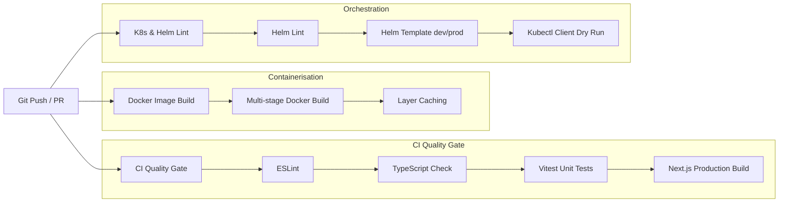

# Continuous Integration & Automated Delivery — ApplyWise AI

## CI/CD Pipeline Design

ApplyWise AI utilizes GitHub Actions to enforce quality gates, automated security checks, container builds, and Kubernetes manifest validation.

## Workflow Specifications

### 1. `ci.yml` — Quality Gate
Runs on every branch push and pull request targeting `master` or `main`:
- **Node.js 20** runtime setup with dependency caching.
- **`npm run lint`**: Zero warnings policy with Next.js and React 19 rules.
- **`npm run type-check`**: Strict TypeScript checking with zero type assertions bypass.
- **`npm test`**: Vitest test runner executing domain unit and integration suites.
- **`npm run build`**: Compiles production standalone bundle.

### 2. `docker.yml` — Container Validation
Validates that `Dockerfile` compiles cleanly into an unprivileged container with no missing build layers.

### 3. `k8s.yml` — Kubernetes & Helm Gate
Runs `helm lint`, renders all templated configurations against `values-development.yaml` and `values-production.yaml`, and runs `kubectl apply --dry-run=client` against all static manifests.
