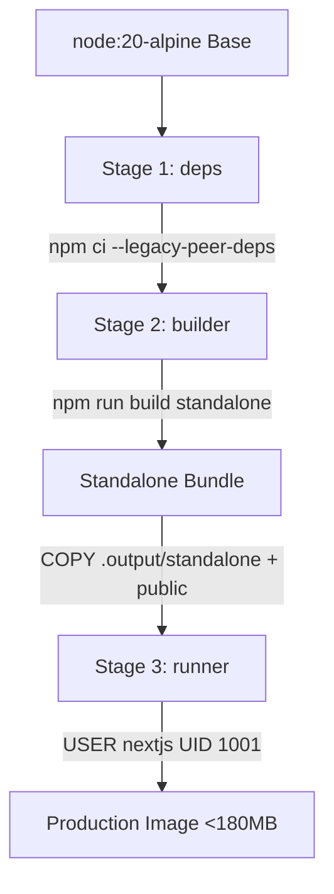

# Docker Containerisation Guide — ApplyWise AI

## Overview

ApplyWise AI features a multi-stage, hardened Docker container built on Node.js 20 Alpine Linux. The container is designed for minimal surface area, strict non-root execution, high-performance standalone runtime, and Kubernetes readiness.

## Multi-Stage Architecture



1. **`deps` Stage**: Installs exact locked dependencies with native Alpine C-compat libraries.
2. **`builder` Stage**: Compiles TypeScript, runs Turbopack optimizations, and outputs a standalone Node.js server.
3. **`runner` Stage**: Strips build tooling, registers unprivileged user `nextjs` (UID 1001), injects healthcheck, and runs `node server.js`.

## Running with Docker Compose

### Prerequisites
Ensure Docker and Docker Compose are installed.

### Start the Application
```bash
# Build and run in detached mode
docker compose up --build -d

# Check running status and health check
docker compose ps

# View real-time container logs
docker compose logs -f app
```

The application will be accessible at `http://localhost:3000`.

### Healthcheck Verification
Inspect the running container health:
```bash
docker inspect --format='{{json .State.Health}}' applywise-ai-app
```

## Security Best Practices
- **Non-root user**: Pod runs as UID 1001 (`nextjs`).
- **No secrets in image**: All API keys and connection strings are injected via runtime environment variables or Kubernetes Secrets.
- **Minimal attack surface**: Alpine Linux runtime contains zero package managers or build compilers.
