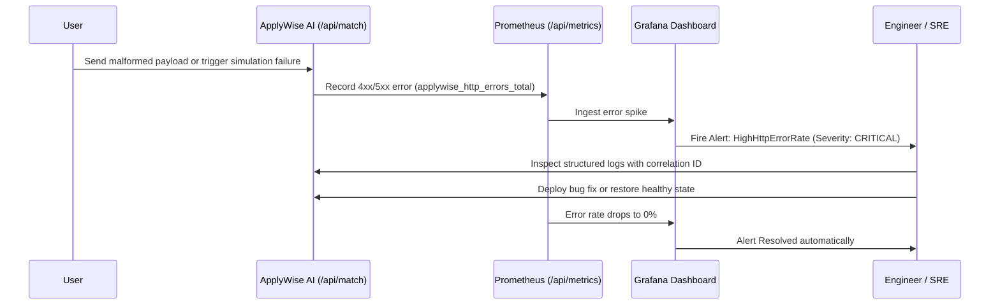

# End-to-End Observability & Operations Recruiter Demonstration

## Overview

This guide provides a live, step-by-step walkthrough script for **Whitemore Ngwira (N. White)** to demonstrate production AI operations, Prometheus metrics scraping, Grafana Cloud dashboards, Kubernetes orchestration, and Infrastructure as Code (Terraform) to technical interviewers and recruiters.

---

## 1. Step-by-Step Live Demonstration Script

### Step 1: Launch & Ingest Application
1. Start the application locally or navigate to the deployed showcase URL:
   ```bash
   npm run dev
   # Or using Docker:
   docker compose up -d
   ```
2. Open your browser to `http://localhost:3000`.
3. Highlight the **Executive Command Center**: point out real-time pipeline KPIs, active candidate profile, and response rate analytics.

### Step 2: Trigger AI Agent Workflow (Job Analysis & Match)
1. Navigate to `/jobs` (Discover Jobs).
2. Select **Lead AI Solutions Architect**.
3. Click **Deep Match Analysis**.
4. Explain what happens under the hood:
   - Request received by `/api/match` wrapped with `withObservability`.
   - Correlation ID generated (`x-correlation-id: req-xxxx`).
   - `MatchService` computes deterministic overlap and invokes `AIGateway`.
   - `AIGateway` routes to Nemotron 3 Ultra via OpenCode Zen / Cloudflare AI Gateway.
   - Structured JSON audit log emitted to console and database.
   - Increments `applywise_http_requests_total`, `applywise_jobs_analyzed_total`, and records duration histograms.

### Step 3: Trigger Semantic Career Copilot (RAG)
1. Navigate to `/rag-search` (Career Copilot).
2. Ask: *"What experience does Whitemore have with real-time IoT telemetry and high-concurrency systems?"*
3. Show the response: grounded in verified chunks from Socinga Smart Mining and EarCodeX with citation pills.
4. Explain telemetry captured:
   - `applywise_rag_retrieval_duration_seconds`
   - `applywise_rag_chunks_retrieved`
   - `applywise_agent_runs_total{agent_name="agentic_rag"}`

### Step 4: Verify Prometheus Metrics Scrape
Open a terminal or new tab:
```bash
curl http://localhost:3000/api/metrics
```
Point out live Prometheus metrics:
- `applywise_http_requests_total{method="POST",route="/api/match",status="200"}`
- `applywise_ai_requests_total{model_id="gemini-flash",status="success"}`
- `applywise_rag_chunks_retrieved_bucket{le="3"}`
- `applywise_node_nodejs_heap_size_used_bytes`

### Step 5: Tour the Grafana Dashboards as Code
Open Grafana Cloud (or local Grafana) and display the 5 version-controlled dashboards:
1. **Application Overview (`01-application-overview.json`)**:
   - Golden signals: Request rate, 5xx error rate, p95 latency, active sessions.
2. **AI Operations (`02-ai-operations.json`)**:
   - Model distribution, inference latency per model, fallback rate, token consumption.
3. **Kubernetes & Container Health (`03-kubernetes-workloads.json`)**:
   - Memory heap used vs total, CPU user seconds rate, event loop lag.
4. **Database & Storage (`04-database-storage.json`)**:
   - Query throughput, query latency, pgvector search stats.
5. **Business Intelligence (`05-business-intelligence.json`)**:
   - Jobs analyzed, application pipeline stages, CV tailoring velocity.

### Step 6: Verify Kubernetes Deployment
```bash
# Verify pods, services, and autoscaler
kubectl get pods -n applywise-ai
kubectl get svc -n applywise-ai
kubectl get hpa -n applywise-ai

# Show zero-downtime rolling update health probes
kubectl describe deployment applywise-ai -n applywise-ai
```

### Step 7: Demonstrate Infrastructure as Code (Terraform)
Show the `/terraform` directory:
```bash
cd terraform
terraform fmt -check -recursive
terraform validate
```
Explain:
- All 5 Grafana dashboards, folders, and contact points are declared in Terraform.
- No dashboards are created solely via UI clicks; the entire monitoring stack can be torn down and recreated from Git.

---

## 2. Safe Controlled Incident & Recovery Scenario

To demonstrate operational triage without risking production stability, run this local simulation:



### Step-by-Step Incident Simulation:
1. **Inject Controlled Error**:
   ```bash
   # Send an invalid payload to /api/match to trigger a 400 Bad Request error
   curl -X POST http://localhost:3000/api/match \
     -H "Content-Type: application/json" \
     -d '{}'
   ```
2. **Observe Structured Log**:
   ```json
   {
     "timestamp": "2026-09-15T19:25:00.000Z",
     "level": "WARN",
     "service": "applywise-ai",
     "correlationId": "req-xxxx-yyyy",
     "event": "unhandled_http_error",
     "message": "jobId is required"
   }
   ```
3. **Observe Metric Increment**:
   ```bash
   curl -s http://localhost:3000/api/metrics | grep "applywise_http_errors_total"
   ```
4. **Observe Grafana Panel**: The "HTTP Error Rate" panel on Dashboard 1 immediately reflects the spike.
5. **Recovery**: Once valid requests resume, the error rate drops back to 0% and alerts auto-resolve.
